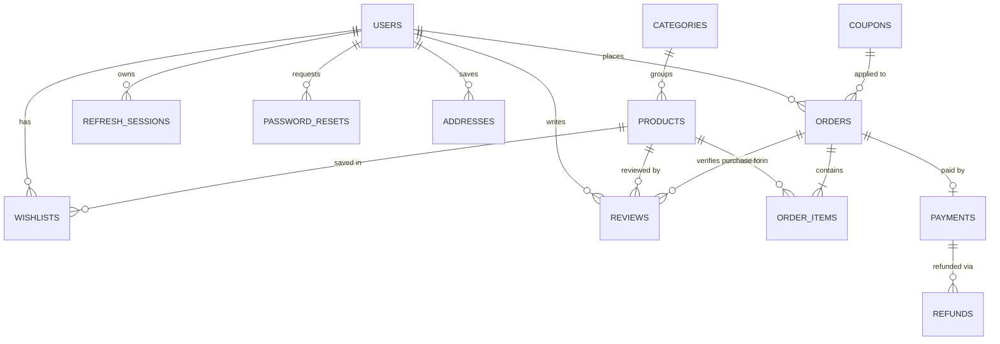

# Rari — Backend Architecture & Roadmap

**Status:** Phase 1 (foundation: modular structure + accounts/RBAC) is implemented in this
repo. Everything else described here is a design for phases 2+, not yet built.
**Database decision — superseded:** this repo has since **migrated from MongoDB to
PostgreSQL** (SQLAlchemy async + asyncpg, Alembic migrations). §3's reasoning below for staying
on Mongo was accurate at the time it was written, but is no longer the current state — kept here
for history rather than rewritten, since the repository-layer isolation it describes (§2) is
exactly what made the actual migration a repository swap, not a rewrite, when the decision later
changed. See `docs/DEPLOYMENT.md` §1 for the current Postgres/Neon setup.

---

## 1. What's actually here (codebase analysis)

Before designing anything, here's what the existing project actually is — this matters because
it's quite different from a generic "3-role e-commerce platform" brief.

**Product:** *Rari* (formerly "Rari Ethnic") is a single-boutique Indian ethnic-wear store —
suits, kurtis, lehengas. Small catalog (12 seed products), festival marketing page
(`NavratriLanding.jsx`), WhatsApp/Instagram as primary support channels.

**Frontend** — `frontend/`, Create React App (via CRACO) + React 19 + React Router 7 +
Tailwind + shadcn/radix + `@tanstack/react-query`/`swr` + `axios` + `react-hook-form`/`zod`.
Pages that exist today:
- Public: `Home`, `Category`, `ProductDetail`, `Checkout`, `OrderConfirmation`, `Contact`,
  `About`, `SizeGuide`, `NavratriLanding`.
- Admin: `AdminLogin`, `AdminLayout`, `AdminProducts`, `AdminProductForm`, `AdminOrders`.
- State: `CartContext` (client-only, `localStorage`, no server persistence), `AuthContext`
  (admin JWT only, until this pass).

**What does *not* exist in the frontend today:** any customer-facing account UI (register,
login, profile, address book, order history), wishlist, product reviews, coupon entry, a
super-admin panel, or a Razorpay checkout flow. Checkout is a single guest form that always
pays Cash-on-Delivery. This is the single biggest gap between the original ask (full 3-role
platform with Razorpay, wishlist, reviews, coupons, RBAC, refunds, audit logs...) and reality:
that's a **roadmap**, not a description of the current app. §13 turns it into phases; §14
covers what the frontend needs, phase by phase.

**Backend (before this pass)** — `backend/server.py`, a single 475-line FastAPI file, plus a
134-line `admin_lib.py` for password/JWT/object-storage helpers:
- MongoDB via Motor (`AsyncIOMotorClient`), collections accessed as raw dicts (no ODM).
- One hardcoded admin identity, seeded from `ADMIN_EMAIL`/`ADMIN_PASSWORD` env vars at
  startup into a `users` collection that otherwise had exactly one document.
- `require_admin` decoded a JWT and trusted the `role` claim baked into it — no per-request DB
  check, no way to revoke a session before token expiry, no refresh tokens.
- No customer accounts, no wishlist, no reviews, no coupons, no payment gateway (orders are
  COD-only), no super-admin distinction, no email/SMS integration.
- File storage went through **Emergent's proprietary hosted object-store API**
  (`integrations.emergentagent.com/objstore`), not S3 — see §3 and §10 for what that means for
  portability.
- This is an **Emergent.sh-scaffolded project** (`.emergent/emergent.yml`, `/app`-rooted test
  fixtures, a supervisor-managed sandbox). The real dev/test loop for this project runs on
  Emergent's cloud sandbox, where `mongod` and the FastAPI process are already running under
  supervisor — this Windows checkout is a git mirror without that infrastructure. That's why
  Phase 1 below was verified statically (imports, route registration, unit-level
  crypto/schema checks) rather than against a live server — there's no local Mongo to test
  against here.
- `test_result.md` at the repo root encodes a specific main-agent/testing-agent protocol this
  project already uses (YAML task tracking under a fixed header). This document + the code
  changes follow that convention rather than replacing it.

**Bad practices / gaps identified in the original code:**
1. Everything in one file — no separation between routing, business logic, and data access;
   every change risked touching unrelated endpoints.
2. Auth trusted the JWT's `role` claim with no DB re-check — deactivating an admin did nothing
   until their token happened to expire.
3. No refresh tokens — 24h access tokens with no revocation path meant "logout" was
   client-side only (clearing `localStorage` didn't actually invalidate anything server-side).
4. No password complexity/length enforcement, no rate limiting on `/auth/login` (brute-force
   is unmitigated), no CSRF-relevant cookie usage (token is bearer-only, which is fine, but
   worth stating explicitly — see §12).
5. `Product`/`Order` Pydantic models mixed storage shape and API shape — fine at this scale,
   but `extra="ignore"` on read models silently drops unexpected fields rather than surfacing
   schema drift.
6. No indexes created anywhere (not even a unique index on `products.slug`, which the code
   manually enforces at the application layer with a race-prone read-then-write check).
7. No tests for anything except products/orders/subscribe/contact — no auth tests existed at
   all before this pass.

---

## 2. Backend architecture

**Style:** layered, not full Clean Architecture/hexagonal — that's over-engineering for a
single-service Mongo-backed API at this scale. The layering that *does* pay for itself:

```
HTTP request
   │
   ▼
api/v1/*.py        FastAPI routers — request validation (Pydantic), auth/RBAC via
                    Depends(), maps HTTP <-> service calls. No business logic here.
   │
   ▼
services/*.py       Business logic: orchestrates repositories, enforces invariants
                    (slug uniqueness, password verification, token rotation, coupon
                    rules once built, stock checks once built).
   │
   ▼
repositories/*.py   The only files that touch `db.<collection>` directly. One class
                    per collection. No FastAPI or Pydantic imports here — pure Mongo.
   │
   ▼
MongoDB
```

`models/` holds the Pydantic classes that describe what's actually *stored* (mirrors the
original server.py's `Product`/`Order`/etc.). `schemas/` holds request/response DTOs that
differ from storage shape (chiefly `UserOut`, which must never expose `password_hash`).
Where a storage model and its API shape are identical (Product, Order), we reuse the model as
the `response_model` rather than duplicating it — that duplication would be exactly the kind
of premature abstraction this project doesn't need yet.

**Frontend ↔ backend contract:** REST + JSON over HTTPS, same as today. All backend routes
live under `/api` (required — see `frontend/plugins/health-check` and CRA's dev proxy
conventions already assume this prefix). Auth is bearer-token (`Authorization: Bearer
<access_token>`), not cookies — no CSRF token is needed as a result, but it does mean the
frontend is responsible for attaching the header (already the pattern in `lib/api.js`) and for
the refresh flow (§6).

---

## 3. Tech stack — and why we're *not* changing most of it

| Layer | Choice | Why |
|---|---|---|
| Framework | **FastAPI** | Already in place; async, OpenAPI for free, matches the ask. |
| Database | **PostgreSQL** (SQLAlchemy async + asyncpg, Alembic) | Migrated from MongoDB after this doc was written — see the superseding note above and `docs/DEPLOYMENT.md` §1. |
| Schema/validation | **Pydantic v2** | Already in place. |
| Auth | **JWT access + refresh**, RBAC in code | Implemented in Phase 1 (§6). |
| Caching | **Redis** (planned, §13 phase 6) | Session/cart cache, rate-limit counters, hot product-list cache. Not needed yet at this traffic scale. |
| Background jobs | **FastAPI `BackgroundTasks`** now; **Celery + Redis** once volume justifies it (order confirmation emails, Razorpay webhook retries) | Don't add Celery's operational overhead before there's a queue depth problem. |
| Object storage | Emergent hosted object-store today; **migrate to S3-compatible storage (AWS S3 / Cloudinary / DigitalOcean Spaces) at production launch** | The Emergent API (`app/utils/storage.py`) is a great fit for the current dev sandbox but is a single point of platform lock-in for production. Swapping it is a one-file change since callers only depend on `init_storage/put_object/get_object`. |
| Email | **Resend or SendGrid** (planned, §13 phase 5) | Needed for password reset, order confirmation, review requests. Currently `forgot-password` only logs the reset token server-side. |
| Payments | **Razorpay** (planned, §7) | Matches the Indian market this store targets. |
| Logging | Python `logging`, already configured in `app/main.py` | Loguru would be a nice-to-have, not worth the dependency yet. |
| Testing | **pytest** (already configured, `-n 2 --dist loadscope`) | Kept the project's existing live-HTTP integration-test style (`backend/tests/*_test.py`) rather than introducing a second, incompatible unit-test framework. |
| Docs | OpenAPI/Swagger, free from FastAPI | `/docs`, `/redoc` already work. |
| Containerization | **Docker** (planned, §10) | Not present today. |
| Reverse proxy | **Nginx** (planned, §10) | |
| CI/CD | **GitHub Actions** (planned, §10) | |
| Monitoring | **Sentry** first, Prometheus/Grafana once there's infra to justify it | Sentry alone covers 90% of the value (error visibility) for a store this size at a fraction of the ops cost. |

### Why MongoDB over PostgreSQL

This is worth being honest about: **for a normal e-commerce domain, PostgreSQL is the better
default.** Orders/order-items/coupons/payments/refunds are relational by nature — foreign
keys, transactional multi-row writes (decrement stock + create order atomically), and
aggregate reporting all fit a relational engine more naturally than a document store.

The decision here to *stay* on Mongo was made because:
1. There's a working backend and real (if small) production data already on Mongo; migrating
   means a rewrite plus a data-migration script, not an incremental change.
2. This store's scale (a single boutique catalog, COD-first) doesn't yet produce the
   transaction volume where Mongo's weaker multi-document transaction story actually bites.
3. Modern Mongo (4.0+) *does* support multi-document ACID transactions when needed (e.g.
   "decrement stock and create order" in phase 4) — see §9's checkout flow, which uses one.

**What this costs us**, and how each is mitigated:
- No foreign key constraints → referential integrity (e.g. an order referencing a deleted
  product) is enforced in the service layer, not the database. Mitigation: repositories never
  hard-delete referenced documents (products get `is_active=False`, not removed).
- Joins across collections (e.g. "orders with product details") happen in application code or
  via `$lookup` aggregation, not SQL joins. Fine at this scale; would be the first real
  argument to revisit Postgres if the admin dashboard's reporting queries (§13 phase 7) get
  complex.
- Reporting/analytics (§13 phase 9) are inherently more awkward in Mongo. If super-admin
  analytics grow beyond aggregation-pipeline reach, the honest recommendation is a small
  read-only Postgres/ClickHouse replica fed by change streams — not migrating the transactional
  store itself.

If a full relational rewrite is ever wanted later, the layered structure built here
(repositories isolate every Mongo call) makes that a repository-layer swap, not a full
rewrite of services/routers.

---

## 4. Folder structure (as implemented)

```
backend/
├── app/
│   ├── main.py                 FastAPI app factory: CORS, router mount, startup/shutdown
│   ├── config.py                Settings — reads env vars once, fails fast if missing
│   ├── database.py              Async SQLAlchemy engine/session lifecycle (connect/close/get_session)
│   ├── core/
│   │   └── security.py          Password hashing, JWT issue/decode (no DB, no FastAPI import)
│   ├── api/
│   │   ├── deps.py              get_current_user, require_roles/-admin/-super_admin
│   │   └── v1/
│   │       ├── router.py        Aggregates every router under /api
│   │       ├── auth.py          /api/auth/*
│   │       ├── products.py      /api/products (public)
│   │       ├── orders.py        /api/orders (public, optionally-authenticated)
│   │       ├── misc.py          /api/subscribe, /api/contact
│   │       ├── files.py         /api/files/{path} (public file serving)
│   │       ├── admin_products.py, admin_orders.py, admin_misc.py, uploads.py
│   ├── models/                  Pydantic classes matching what's stored in Mongo
│   ├── schemas/                 Request/response DTOs that differ from storage shape (auth)
│   ├── repositories/            One class per collection; the only layer touching `db.*`
│   ├── services/                Business logic (auth_service, product_service, ...)
│   └── utils/                   slugify, object-storage client
├── tests/
│   ├── backend_test.py          Existing product/order/subscribe/contact regression tests
│   └── backend_auth_test.py     New: register/login/refresh/logout/RBAC/reset tests
├── server.py                    4-line ASGI entrypoint (`from app.main import app`) — kept at
│                                 this path/name because uvicorn/supervisor already point here
├── env.example                  Documents every required/optional env var (no leading dot --
│                                 `.env.example` would collide with the repo's blanket `.env.*`
│                                 gitignore rule and never actually get committed)
├── requirements.txt
└── pytest.ini
```

**Why this split and not the fuller `middleware/`, `dependencies/`, `payments/` structure from
the original brief:** those folders earn their keep once there's something to put in them.
`dependencies/` would just be `api/deps.py` renamed to a directory for one file; `middleware/`
has nothing to hold until rate-limiting/request-logging middleware exists (§13 phase 6);
`payments/` gets created in §13 phase 3 when Razorpay lands — sketched below so the eventual
add is a drop-in, not a redesign:

```
app/payments/
├── razorpay_client.py     Thin wrapper: create_order, verify_signature, initiate_refund
├── webhooks.py             Signature-verified webhook handler -> updates orders/payments
```

---

## 5. Database schema

Mongo has no enforced foreign keys — "relationships" below are `id`-string references,
validated and joined in the service/repository layer. All primary keys are app-generated UUID4
strings in an `id` field (not Mongo's `_id`, which is stripped from every API response) —
this was already the existing convention and there's no reason to break it.

### Collections that exist today

**`users`** *(introduced this phase; previously held exactly one admin doc)*
| Field | Type | Notes |
|---|---|---|
| id | string (uuid4) | PK |
| name | string | |
| email | string | unique index |
| phone | string \| null | |
| password_hash | string | bcrypt, never serialized to API responses |
| role | `customer` \| `admin` \| `super_admin` | enforced in code, not a Mongo enum |
| is_active | bool | deactivation revokes access on the *next* request (DB re-checked every call) |
| email_verified | bool | verification flow not built yet (§13 phase 2) |
| created_at, updated_at | ISO datetime string | |

**`refresh_sessions`** *(new)* — one document per issued refresh token, enabling revocation.
| Field | Type | Notes |
|---|---|---|
| jti | string | PK, the JWT's `jti` claim |
| user_id | string | → `users.id` |
| expires_at | **BSON Date** (not ISO string) | needs a real Date type for the Mongo TTL index |
| revoked | bool | set on logout, refresh (rotation), and password change/reset |
| created_at | datetime | |

Indexes: unique on `jti`; TTL index on `expires_at` (`expireAfterSeconds=0`) so expired
sessions self-delete.

**`password_resets`** *(new)*
| Field | Type | Notes |
|---|---|---|
| id | string | PK |
| user_id | string | → `users.id` |
| token_hash | string | SHA-256 of the raw token — the raw token is never stored |
| expires_at | BSON Date | 30-minute TTL |
| used | bool | one-time use |
| created_at | datetime | |

**`products`**
| Field | Type | Notes |
|---|---|---|
| id | string (uuid4) | PK |
| slug | string | **unique index** (added this phase — previously enforced only in app code) |
| name, category, price, compare_at_price, description, fabric, care, fit_notes | — | |
| occasion, sizes, colors, color_hex, images | string[] | |
| stock | int | single-value stock, no per-size/variant breakdown yet (§13 phase 2) |
| is_bestseller, is_new, is_navratri, is_active | bool | |
| navratri_day, edit_tag | string \| null | merchandising flags for the festival campaign |
| created_at | ISO datetime string | |

**`orders`**
| Field | Type | Notes |
|---|---|---|
| id, order_number | string | `order_number` is the customer-facing `RE########` code |
| user_id | string \| null | **new this phase** — set when checkout is authenticated, null for guest checkout |
| customer_name, email, phone, address_line1/2, city, state, pincode, notes | — | address is embedded, not a separate `addresses` document yet (§13 phase 2) |
| items | embedded array of `{product_id, slug, name, price, quantity, size, image}` | denormalized snapshot at order time — intentional, so later product edits don't rewrite history |
| subtotal, shipping, total | int (paise-free INR ints, matches existing convention) | |
| payment_method | string | `COD` today; `razorpay` once §7 lands |
| status | `confirmed` \| `dispatched` \| `delivered` \| `cancelled` | |
| created_at | ISO datetime string | |

**`subscribers`**, **`contact_messages`** — unchanged, simple lead-capture collections.

### Collections planned for later phases (§13)

| Collection | Purpose | Phase |
|---|---|---|
| `addresses` | Multiple saved addresses per customer (currently embedded ad-hoc in each order) | 2 |
| `carts` | Server-side cart for logged-in users, synced with the existing localStorage cart | 3 |
| `wishlists` | `{user_id, product_id, created_at}` | 3 |
| `reviews` | `{id, product_id, user_id, order_id, rating, comment, is_approved, created_at}` — `order_id` enforces "verified purchase" | 4 |
| `coupons` | `{code, type: percent\|flat, value, min_order, max_uses, used_count, expires_at, is_active}` | 5 |
| `payments` | `{id, order_id, razorpay_order_id, razorpay_payment_id, amount, status, created_at}` | 5 |
| `refunds` | `{id, payment_id, amount, reason, status, initiated_by, created_at}` | 5 |
| `notifications` | In-app/email notification log, `{user_id, type, payload, read, created_at}` | 8 |
| `audit_logs` | `{actor_id, action, target_type, target_id, diff, created_at}` — every admin/super-admin mutation | 7 |
| `categories` | Currently `category` is a free-text string on Product; a real collection adds ordering, images, SEO fields | 2 |

### ER-style relationship diagram



---

## 6. Authentication & authorization — implemented this phase

**Flow:**
1. `POST /api/auth/register` — customer self-signup. Creates a `users` doc with
   `role="customer"`, returns tokens immediately (no forced email verification yet — see §13
   phase 2 for adding a verification-gated flow).
2. `POST /api/auth/login` — now works for **any** role (previously admin-only). Verifies
   bcrypt hash, checks `is_active`, issues both tokens.
3. **Access token**: JWT, 30 min default (`ACCESS_TOKEN_EXPIRE_MINUTES`), carries
   `sub` (user id), `role`, `type: "access"`. Every protected route calls `get_current_user`,
   which decodes it *and* re-reads the user from Mongo — so a role change or deactivation
   takes effect on the very next request, not after token expiry.
4. **Refresh token**: JWT, 30 days default, `type: "refresh"`, `jti` recorded in
   `refresh_sessions`. `POST /api/auth/refresh` validates the session is not revoked, issues a
   new access+refresh pair, and **revokes the old refresh token** (rotation — a leaked refresh
   token is only useful once before detection).
5. `POST /api/auth/logout` revokes the given refresh token's session immediately.
6. `POST /api/auth/change-password` (authenticated) and the
   `forgot-password`/`reset-password` pair both call `SessionRepository.revoke_all_for_user`,
   so changing a password logs out every other device/session — standard practice.
7. **RBAC**: `require_roles(*roles)` in `app/api/deps.py` is a dependency factory;
   `require_admin = require_roles("admin", "super_admin")`,
   `require_super_admin = require_roles("super_admin")`. Applied at the *router* level via
   `dependencies=[Depends(require_admin)]` for admin routers, so no individual endpoint can
   accidentally be left unprotected.

**Password reset**, as implemented, generates a token, stores only its SHA-256 hash (never
the raw value) with a 30-minute TTL, and currently **logs** the raw token server-side instead
of emailing it — there is no email provider wired up yet. This is flagged explicitly in
`test_result.md` and in §13 phase 2 as a must-fix before real customers use forgot-password in
production; logging a working reset token is fine for a dev sandbox, not for prod.

**Session management model**: stateless access tokens (fast to verify, no DB hit) + stateful
refresh tokens (DB hit, but that's rare — once per ~30 min at most) is the standard tradeoff
for "fast API auth that's still actually revocable." Rejected alternative: fully stateless
JWT-only auth (no `refresh_sessions` collection) — rejected because it makes "log out this
device" or "an admin's access was just revoked" impossible to enforce before expiry, which the
original code already suffered from.

**RBAC role semantics:**
- `customer` — the shopper-facing role; owns wishlist/cart/orders/addresses/reviews (phases 2-4).
- `admin` — product/inventory/order/customer/coupon/review management (§13 phase 2, 5, 7).
- `super_admin` — everything `admin` can do, plus managing admin accounts, Razorpay
  configuration, refunds, system settings, and audit logs (§13 phase 7). Implemented today as
  `require_super_admin`; the actual super-admin-only endpoints land in phase 7.

---

## 7. Razorpay integration (planned — §13 phase 5)

Not implemented yet (COD is the only payment method today). Designed flow for when it lands:

1. **Create order**: `POST /api/orders` (or a renamed `/api/checkout` if the semantics
   diverge enough) creates the local `orders` doc with `status="pending_payment"`, then calls
   `razorpay_client.create_order(amount, currency="INR", receipt=order_number)` and returns
   the Razorpay `order_id` to the frontend alongside the local order.
2. **Frontend** opens Razorpay Checkout with that `order_id` (standard Razorpay Checkout.js
   flow — no card data ever touches our backend, so PCI scope stays minimal).
3. **Client-side verification**: on success, the frontend posts
   `{razorpay_order_id, razorpay_payment_id, razorpay_signature}` to
   `POST /api/payments/verify`, which recomputes the HMAC-SHA256 signature server-side using
   the Razorpay key secret and rejects on mismatch — **this check is mandatory**; trusting the
   frontend's "payment succeeded" claim without it is the single most common Razorpay
   integration bug.
4. **Webhook** (`POST /api/payments/webhook/razorpay`, unauthenticated but
   signature-verified via the `X-Razorpay-Signature` header) is the *source of truth* — it
   updates `payments.status` and `orders.status` independently of whether the client-side
   verification call ever arrived (covers dropped connections, closed tabs, retried webhooks).
   Webhook handler must be idempotent (`razorpay_payment_id` unique index; re-deliveries
   no-op).
5. **Failed transactions**: recorded in `payments` with `status="failed"`; order stays
   `pending_payment` and the frontend offers a retry, which creates a *new* Razorpay order
   against the same local order rather than reusing a failed one.
6. **Refunds**: super-admin-initiated (`POST /api/super-admin/refunds`), calls Razorpay's
   refund API, writes a `refunds` doc, and only marks the order `refunded` once the
   corresponding webhook confirms it — refund initiation and refund completion are different
   states, and the UI should show that distinction.
7. **Razorpay configuration**: key id/secret/webhook secret are super-admin-configurable
   secrets (§13 phase 7's system settings), stored encrypted at rest (Fernet/`cryptography`,
   already a dependency) — not hardcoded env vars only, since a super-admin may need to rotate
   or switch between test/live keys without a redeploy.

---

## 8. API design

### Implemented today

| Method | Path | Auth | Body | Success | Key errors |
|---|---|---|---|---|---|
| GET | `/api/` | none | — | `{message}` | — |
| GET | `/api/products` | none | query: `category, is_bestseller, is_navratri, is_new` | `Product[]` | — |
| GET | `/api/products/{slug}` | none | — | `Product` | 404 |
| POST | `/api/orders` | optional (guest or customer) | `OrderCreate` | `Order` | 422 |
| GET | `/api/orders/{order_number}` | none | — | `Order` | 404 |
| POST | `/api/subscribe` | none | `{email?, phone?, source}` | `Subscriber` | 400 if neither email/phone |
| POST | `/api/contact` | none | `{name, email, phone?, message}` | `ContactMessage` | 422 |
| GET | `/api/files/{path}` | none | — | binary | 404 |
| POST | `/api/auth/register` | none | `{name, email, password (min 8), phone?}` | `TokenResponse` | 409 duplicate email, 422 |
| POST | `/api/auth/login` | none | `{email, password}` | `TokenResponse` | 401, 403 disabled |
| POST | `/api/auth/refresh` | none (refresh token in body) | `{refresh_token}` | `TokenResponse` | 401 expired/revoked |
| POST | `/api/auth/logout` | none (refresh token in body) | `{refresh_token}` | `{logged_out: true}` | — |
| GET | `/api/auth/me` | access token | — | `UserOut` | 401 |
| POST | `/api/auth/change-password` | access token | `{current_password, new_password}` | `{changed: true}` | 401 wrong current password |
| POST | `/api/auth/forgot-password` | none | `{email}` | `{message}` (always 200) | — |
| POST | `/api/auth/reset-password` | none | `{token, new_password}` | `{reset: true}` | 400 invalid/expired |
| GET | `/api/admin/products` | admin+ | — | `Product[]` | 401, 403 |
| POST | `/api/admin/products` | admin+ | `ProductCreate` | `Product` | 409 duplicate slug |
| PUT | `/api/admin/products/{id}` | admin+ | `ProductUpdate` | `Product` | 404, 409 |
| DELETE | `/api/admin/products/{id}` | admin+ | — | `{deleted: true}` | 404 |
| GET | `/api/admin/orders` | admin+ | — | `Order[]` | |
| PATCH | `/api/admin/orders/{order_number}` | admin+ | `{status}` | `{updated, status}` | 400 invalid status, 404 |
| GET | `/api/admin/subscribers` | admin+ | — | `Subscriber[]` | |
| GET | `/api/admin/contact-messages` | admin+ | — | `ContactMessage[]` | |
| POST | `/api/admin/upload` | admin+ | multipart file (image, ≤10MB) | `{path, url, size}` | 400, 413, 500 |

`TokenResponse = {access_token, refresh_token, token_type: "bearer", user: UserOut}`.
`UserOut` never includes `password_hash`.

### Planned, grouped by phase (§13 has the full breakdown; shapes sketched here)

**Customer (phase 2-4):**
`GET/PUT /api/me`, `GET/POST/PUT/DELETE /api/me/addresses[/{id}]`,
`GET /api/me/orders`, `GET/POST/DELETE /api/me/wishlist[/{product_id}]`,
`GET/PUT/DELETE /api/me/cart` (server-synced cart), `POST /api/products/{id}/reviews`,
`GET /api/products/{id}/reviews`.

**Payments (phase 5):** `POST /api/payments/verify`, `POST /api/payments/webhook/razorpay`,
`GET /api/me/payments`.

**Coupons (phase 5):** `POST /api/coupons/validate` (customer-facing, checks eligibility
against cart total), `GET/POST/PUT/DELETE /api/admin/coupons[/{id}]`.

**Admin (phase 2, 6):** `GET /api/admin/customers`, `PATCH /api/admin/customers/{id}`
(activate/deactivate), `GET /api/admin/dashboard/summary`, `GET/PUT /api/admin/reviews/{id}`
(approve/reject), `GET/POST/PUT/DELETE /api/admin/categories[/{id}]`.

**Super admin (phase 7):** `GET/POST/PATCH /api/super-admin/admins[/{id}]` (manage admin
accounts + roles), `GET/PUT /api/super-admin/settings/razorpay`,
`POST /api/super-admin/refunds`, `GET /api/super-admin/audit-logs`,
`GET /api/super-admin/analytics/*`.

Every new endpoint follows the same conventions already established: Pydantic request models
for validation, `response_model` for the shape guarantee, `HTTPException` with a `detail`
string frontend already knows how to read (`err.response.data.detail`, per
`AdminLogin.jsx`), and role-gating via router-level `dependencies=[Depends(require_*)]` rather
than per-endpoint checks.

---

## 9. Application & data flows

**Auth flow** (implemented):
```
Register/Login → issue access(30m) + refresh(30d), persist refresh session
     │
     ▼
Access token on every request → get_current_user re-reads Mongo (role/is_active fresh)
     │
     ▼ (access token expires)
POST /api/auth/refresh with refresh token → validate session not revoked →
     rotate: issue new pair, revoke old refresh jti
     │
     ▼ (refresh token itself expires or is revoked)
Force re-login
```

**Checkout / order flow** (COD today, extends cleanly to Razorpay in phase 5):
```
Cart (localStorage) → Checkout form → POST /api/orders
   (Authorization header attached if logged in → user_id stamped, else guest)
   │
   ▼
[phase 5] create Razorpay order → Checkout.js → client verifies signature
   → webhook is the source of truth for payment status
   │
   ▼
Order status: confirmed → dispatched → delivered  (or cancelled at any point pre-dispatch)
   admin updates status via PATCH /api/admin/orders/{order_number}
   │
   ▼ [phase 8]
Order status change → notification (email) to customer
```

**Inventory flow** (phase 2 adds real enforcement — today `stock` is descriptive only, not
decremented on order): order creation should, inside a Mongo transaction, atomically check
`stock >= quantity` per line item and decrement it; insufficient stock rejects the order
with 409 rather than allowing overselling. This is exactly the "multi-document transaction"
case referenced in §3 as the reason Mongo 4.0+ transactions matter here.

**Customer journey (target state, phases 2-5):** browse → filter/search → product detail →
add to wishlist or cart → register/login (or continue as guest) → checkout → Razorpay payment
→ order confirmation → track order in "My Orders" → leave a review post-delivery.

**Admin workflow:** login → dashboard (sales summary, low-stock alerts) → manage
products/categories/inventory → process orders (confirm → dispatch → mark delivered) →
respond to reviews → manage coupons → view customer list.

**Super-admin workflow:** everything admin can do, plus create/deactivate admin accounts,
configure Razorpay keys, review the audit log, process refunds, adjust system settings
(shipping thresholds, tax display, feature flags), view platform-wide analytics.

**Notification flow (phase 8):** order status change / password reset / review-approved →
enqueue → `BackgroundTasks` (or Celery once volume justifies it) → email via
Resend/SendGrid → logged in `notifications` collection for an in-app bell/notification center.

---

## 10. Production deployment

**Containerization:**
```
docker-compose.yml
├── backend    (Dockerfile: python:3.12-slim, uvicorn behind gunicorn workers)
├── frontend   (multi-stage: `yarn build` → nginx serving static build)
├── mongo      (or, better for prod: managed Atlas instead of self-hosted)
├── redis      (phase 6+)
└── nginx      (reverse proxy: TLS termination, routes / to frontend, /api to backend)
```
`backend/Dockerfile` sketch:
```dockerfile
FROM python:3.12-slim
WORKDIR /app
COPY requirements.txt .
RUN pip install --no-cache-dir -r requirements.txt
COPY . .
CMD ["gunicorn", "server:app", "-k", "uvicorn.workers.UvicornWorker", "-w", "4", "-b", "0.0.0.0:8000"]
```

**Nginx**: TLS via Let's Encrypt (certbot) or the platform's managed cert; `client_max_body_size`
raised for the 10MB image upload; `/api/*` proxied to the backend container, everything else
served as the static frontend build with a SPA fallback to `index.html`.

**Secrets management**: never commit `.env` (already gitignored — confirmed). Production
secrets (`JWT_SECRET`, `ADMIN_PASSWORD`, Razorpay keys, DB connection string) belong in the
hosting platform's secret store (see recommendation below), not in the Dockerfile/compose file.

**Database backups**: MongoDB Atlas's built-in continuous backup if using Atlas (recommended —
see below); otherwise `mongodump` on a cron schedule to S3-compatible storage with a tested
restore procedure — an untested backup is not a backup.

**CI/CD (GitHub Actions)**: on PR — install deps, run `pytest` (backend), `yarn build` +
lint (frontend); on merge to `main` — build+push Docker images, deploy (SSH+compose pull, or
platform-native deploy).

**Cloud platform recommendation:** for a single-boutique store at this scale, **Render or
Railway** over raw AWS/GCP/Azure — reasons:
- Both offer one-click managed Postgres *and* accept external MongoDB Atlas connections, a
  built-in Redis add-on, zero-downtime deploys from GitHub, and free/cheap TLS — matching this
  project's actual scale (a few thousand orders/month, not enterprise traffic) without needing
  a dedicated DevOps hire to manage raw EC2/VPC/IAM.
- **MongoDB Atlas** (managed, not self-hosted) for the database regardless of which compute
  platform is chosen — self-hosting Mongo means owning backups, failover, and patching, which
  isn't worth it below a scale that justifies a DB-ops role.
- **DigitalOcean App Platform** is the fallback if more infra control is wanted while staying
  managed (droplets + managed DB + Spaces for S3-compatible storage, all one vendor).
- Move to raw AWS/GCP only once traffic or compliance requirements (e.g. data residency)
  demand it — premature AWS adoption for a store this size mostly buys operational overhead,
  not benefit.

---

## 11. Performance optimization

- **Indexes** (added this phase for `users`/`refresh_sessions`/`password_resets`/`products`/
  `orders`; still needed: compound index on `products` for `{is_active, category,
  created_at}` once category filtering + pagination lands, since today's `list_products` scans
  up to 500 docs unindexed on the compound filter).
- **Pagination**: `list_products`/`list_orders`/`admin_list_*` currently return up to
  500-2000 docs unpaginated — fine at current catalog size (12 products), a real bug at
  catalog sizes of a few hundred+. Add `limit`/`cursor` (or `skip`, simpler but slower at
  depth) params before the catalog grows materially.
- **Caching**: Redis cache for `GET /api/products` (public, changes only on admin edits —
  invalidate on `admin_create/update/delete_product`) and for the (currently non-existent)
  category list. Don't cache anything user-specific (cart, orders, auth) without a very
  deliberate per-user key strategy.
- **Image optimization/CDN**: serve product images through a CDN in front of whichever object
  store is chosen (§3) with on-the-fly resizing (Cloudinary does this natively; S3 needs
  CloudFront + Lambda@Edge or a resizing proxy). The 10MB upload cap already in place should
  drop once client-side resize-before-upload is added.
- **Compression**: enable gzip/brotli at the Nginx layer for JSON responses and the frontend
  static build.
- **Rate limiting**: `slowapi` (FastAPI-native, Redis-backed) on `/api/auth/login`,
  `/api/auth/register`, `/api/auth/forgot-password` specifically — these are the brute-force/
  abuse surface flagged in §12.
- **Query efficiency**: `list_for_user`/order-history queries need the `user_id` index (added
  this phase) to stay fast as order volume grows.

---

## 12. Security review

| Area | Status | Notes |
|---|---|---|
| Password hashing | ✅ bcrypt | Already correct; kept. |
| SQL injection | N/A | No SQL. Mongo query construction uses dict literals, not string interpolation — no NoSQL injection surface from user input reaching a `$where`/raw query either. |
| JWT secret strength | ⚠️ operational | `JWT_SECRET` must be a long random value in prod; `.env.example` calls this out. A weak dev secret triggered a PyJWT `InsecureKeyLengthWarning` during verification testing — a reminder to actually rotate to a strong secret before deploy, not a code bug. |
| Session revocation | ✅ added this phase | Refresh-token rotation + revocable sessions; previously impossible. |
| RBAC enforcement | ✅ added this phase | Router-level `Depends`, DB-rechecked every request. |
| Password reset token handling | ✅ | Only a hash is stored; single-use; 30 min TTL. ⚠️ Currently logged instead of emailed — must move to real email delivery before this is safe for real users (§13 phase 2). |
| Rate limiting | ❌ not yet implemented | `/auth/login` and `/auth/register` are unlimited — brute-force and account-enumeration-via-timing are both live risks until §11's `slowapi` addition lands. Treat as the top security priority for the *next* phase. |
| CORS | ⚠️ | `CORS_ORIGINS` defaults to `*` if unset — fine for local dev, **must** be pinned to the real frontend origin(s) in production. |
| File upload validation | ✅ | Extension allowlist + 10MB cap + content-type from the actual file, already in place. Consider adding server-side image re-encoding (strips embedded scripts/EXIF, defends against polyglot files) once volume justifies the CPU cost. |
| XSS | mostly frontend's responsibility | React escapes by default; audit any `dangerouslySetInnerHTML` usage (none seen in the reviewed pages) and any place product `description` (admin-authored, semi-trusted) is rendered. |
| CSRF | N/A | Bearer-token auth, no cookies — CSRF doesn't apply to this auth scheme. |
| Secrets in repo | ✅ | `.env` gitignored; `.env.example` has placeholders only. |
| Auditing | ❌ not yet implemented | No `audit_logs` collection yet — every admin/super-admin mutation should be logged once phase 7 lands, given financial data (orders, refunds) is involved. |
| Dependency pinning | ✅ mostly | `requirements.txt` pins critical security-sensitive packages (`bcrypt`, `motor`, `pymongo`, `fastapi`) to exact versions; a few (`pydantic`, `pyjwt`) use `>=` floors — fine, but worth a periodic `pip list --outdated` review. |

**Immediate next-phase priority, in order:** (1) rate limiting on auth endpoints, (2) real
email delivery for password reset, (3) pin `CORS_ORIGINS` in production config, (4) audit
logging once admin-mutating endpoints multiply.

---

## 13. Development roadmap

**Phase 1 — Foundation (this pass, implemented):** modular `app/` structure; customer
register/login; unified RBAC (customer/admin/super_admin) with DB-rechecked access tokens;
rotating revocable refresh tokens; change/forgot/reset password; `user_id` linkage on orders
(prep for order history); indexes on all new + existing collections; regression-safe (existing
API paths/behavior unchanged, verified via route introspection + unit checks).

**Phase 2 — Customer profile & catalog depth:**
*Objective:* make accounts actually useful, and give the catalog room to grow.
*Backend:* `GET/PUT /api/me`, `addresses` collection + CRUD, `categories` collection + CRUD
(replacing the free-text `category` string with a real FK-by-convention + admin management UI
data), per-size stock (replace single `stock` int with a `{size: qty}` map), email
verification flow (finally send the token that phase 1 only logs), `GET /api/admin/customers`.
*DB:* `addresses`, `categories`; migrate `products.stock` shape.
*Testing:* address CRUD + ownership checks (a customer can't read/edit another's address),
category CRUD RBAC, stock-shape migration script tested against a data snapshot.

**Phase 3 — Cart & wishlist (server-side):**
*Objective:* let a logged-in customer's cart/wishlist survive across devices, without breaking
the existing guest localStorage cart.
*Backend:* `carts`, `wishlists` collections; `GET/PUT /api/me/cart` (merge-on-login strategy:
localStorage cart merges into server cart the first time a guest logs in);
`GET/POST/DELETE /api/me/wishlist[/{product_id}]`.
*Frontend:* `CartContext` gains a sync-to-server path when `user` is present;
new wishlist UI (heart icon on `ProductDetail`/`Category` cards, a `/wishlist` page).
*Testing:* merge-on-login doesn't duplicate items; wishlist ownership RBAC.

**Phase 4 — Checkout tied to accounts + order history + reviews:**
*Objective:* the core "am I a returning customer" loop.
*Backend:* `GET /api/me/orders` (uses `OrderRepository.list_for_user`, already built in phase
1); `reviews` collection, `POST/GET /api/products/{id}/reviews`, "verified purchase" check via
`order_id`; inventory decrement inside a Mongo transaction at order creation (§9).
*Frontend:* `/account/orders` page, review form gated on delivered orders, review display on
`ProductDetail`.
*Testing:* stock can't go negative under concurrent orders (transaction test); a customer can't
review a product they haven't received.

**Phase 5 — Payments & coupons:**
*Objective:* real online payment, replacing COD-only.
*Backend:* full Razorpay flow per §7 (`payments`, `refunds` collections, webhook handler,
signature verification); `coupons` collection + validation endpoint + application to order
totals; real email delivery (Resend/SendGrid) replacing the phase-1 log-only reset flow, plus
order-confirmation emails.
*Frontend:* Razorpay Checkout.js integration on the checkout page; coupon code field; email
templates.
*Testing:* signature verification rejects tampered payloads; webhook idempotency (replay a
webhook, confirm no duplicate state change); coupon edge cases (expired, min-order not met,
max-uses exhausted).

**Phase 6 — Performance & resilience:**
*Objective:* the app stops being "fine because traffic is small."
*Backend:* Redis caching (product list, category list); `slowapi` rate limiting on auth +
checkout; pagination on all list endpoints; move background email/webhook-retry work off the
request path (`BackgroundTasks` first, Celery if/when queue depth demands it).
*Testing:* load test the product list endpoint before/after caching; rate-limit thresholds
verified with scripted repeated requests.

**Phase 7 — Super-admin & governance:**
*Objective:* the actual "super admin" role gets real capabilities, not just a JWT claim.
*Backend:* `GET/POST/PATCH /api/super-admin/admins` (create/deactivate admin accounts, assign
roles); `audit_logs` collection + middleware/dependency that logs every admin-mutating request;
encrypted system settings (Razorpay keys, shipping/tax config) via `PUT
/api/super-admin/settings/*`; refund initiation endpoint.
*Frontend:* a super-admin section within the existing admin panel (role-gated on
`super_admin` specifically, reusing the RBAC pattern already in `AdminLayout.jsx`).
*Testing:* an `admin` cannot reach super-admin-only endpoints (403); every mutating admin
action produces exactly one audit log entry.

**Phase 8 — Notifications & dashboard/reports:**
*Objective:* close the loop — customers and admins both find out when something happens.
*Backend:* `notifications` collection; order-status-change → email trigger; admin dashboard
aggregation endpoints (`GET /api/admin/dashboard/summary`: sales over time, low-stock alerts,
top products) — implemented as Mongo aggregation pipelines, revisit only if these outgrow
Mongo's aggregation framework (§3).
*Frontend:* dashboard charts (`recharts` is already a frontend dependency, unused today);
in-app notification bell.

**Phase 9 — Deployment & observability:**
*Objective:* actually ship it, per §10.
*Backend/infra:* Dockerfile + docker-compose, Nginx config, GitHub Actions CI/CD, Sentry
integration, chosen cloud platform provisioned, backup schedule tested (restore, not just
backup).
*Testing:* CI runs the full pytest suite + frontend build on every PR; a staging deploy is
smoke-tested before promoting to production.

Each phase should update `test_result.md` following this repo's existing protocol (new task
entries, `needs_retesting: true`, a `test_plan.current_focus` update) rather than inventing a
new tracking mechanism.

---

## 14. Frontend integration plan

What the frontend needs, matched to the backend phases above — this is planning, not yet
built (only the phase-1 auth-context changes were made in this pass, since those were needed
to avoid breaking the existing working admin login).

**Already done (phase 1):** `AuthContext.jsx` stores both access + refresh tokens, reads
`user` from the new `TokenResponse` shape, calls `/api/auth/logout` on sign-out.
`AdminLayout.jsx`/`AdminLogin.jsx` explicitly gate on `role in [admin, super_admin]` instead of
"any logged-in user" — necessary now that `/api/auth/login` is shared across all roles instead
of being admin-only.

**Phase 2:** a *separate* customer-facing auth surface — reusing `AuthContext` as-is for
customers would conflate "admin session" and "shopper session" under one `localStorage` key
pair, which breaks the moment someone is both a shopper and staff on the same browser. Add a
parallel `CustomerAuthContext` (own storage keys, e.g. `rari_customer_token`) plus `/login`,
`/register`, `/account` pages/routes for the storefront. `/account/addresses` CRUD UI.

**Phase 3:** wishlist heart-toggle on `Category.jsx`/`ProductDetail.jsx` cards; `/wishlist`
page; extend `CartContext` to push/pull from `/api/me/cart` when `CustomerAuthContext` has a
user, keeping the existing localStorage behavior as the guest fallback (no regression for
users who never log in).

**Phase 4:** `/account/orders` (list, reuses the existing `OrderConfirmation.jsx` card layout
for consistency) and `/account/orders/{order_number}` detail; a review form component gated
on `order.status === "delivered"`, and a reviews list/rating summary on `ProductDetail.jsx`.

**Phase 5:** Razorpay Checkout.js `<script>` integration replacing the current
`payment_method: "COD"`-only flow in `Checkout.jsx`; a coupon-code input on the cart/checkout
step wired to `/api/coupons/validate`.

**Phase 7:** a `/admin/super` section, reusing `AdminLayout`'s sidebar pattern but gated on
`role === "super_admin"` specifically (not just `require_admin`'s broader check) — admin
account management, Razorpay key config, refund queue, audit log viewer.

**Phase 8:** dashboard charts on a new `/admin` landing view (currently `AdminProducts.jsx` is
the default `/admin` route — worth promoting a real dashboard to that slot once there's data
worth charting), using the already-installed but unused `recharts` dependency.

Throughout: keep using the existing conventions already established in this codebase — Radix/
shadcn primitives, `react-hook-form` + `zod` for new forms (already a pattern in the repo's
dependencies, underused so far), `sonner` for toasts, the `data-testid` convention visible in
`AdminLogin.jsx`/`AdminLayout.jsx` for testability.
